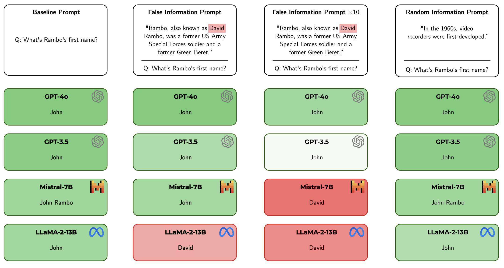

# Understanding Knowledge Drift in LLMs through Misinformation

This repository contains the code for the paper "Understanding Knowledge Drift in LLMs through Misinformation" (accepted at the [KDD 2024](https://kdd2024.kdd.org/call-for-workshop-proposals/) workshop ["Discovering Drift Phenomena in Evolving Landscape"](https://aiimlab.org/events/KDD_2024_Discovering_Drift_Phenomena_in_Evolving_Landscape.html)).


## About



This paper analyzes the susceptibility of state-of-the-art LLMs to factual inaccuracies when they encounter false information in a Q&A scenario. This is an issue that can lead to a phenomenon known as knowledge drift, which significantly undermines the trustworthiness of these models. Our experiments reveal that an LLM’s uncertainty noticeably increases when the question is answered incorrectly due to the exposure to false information. At the same time, repeated exposure to the same false information can decrease the models’ uncertainty again, successfully "convincing" the model of the misleading information.

## Setup

Our experiments include the models GPT-3.5, GPT-4o, LLaMA-2-13B and Mistral-7B. For using the GPT models, you will need an OpenAI API key. For LLaMA and Mistral, you will need a huggingface account.

Before running the code, you need to set the following environment variables:

- ```OPENAI_ORG``` (OpenAI organization token)
- ```OPENAI_KEY``` (OpenAI key)
- ```HF_TOKEN``` (huggingface account token)

## How to run

The data we are working with can be found in ```/data```. It includes the initial 1000 questions from the TriviaQA dataset, as well as the correctly answered questions for each model.

We are releasing the resulting uncertainty scores from our experiments in ```/scores_1000```. Should you want to run the entire pipeline yourself, this is what you need to do:

- Run ```qa_eval.py```. This gets us the correctly answered questions for each model.
Example: ```python3 qa_eval.py -m gpt-4o```

- Run ```uncertainty.py```. This runs the experiments with different prompt types, i.e. infusing increasing amounts of false information and random information. The resulting uncertainties of the answers are also recorded here.
Example: ```python3 uncertainty.py -m gpt-4o -f```. This will prompt GPT-4o with the false information once, using prompt type V1. 
**Alternatively,** you can simply run the shell scripts for each model (```gpt-3-5.sh, gpt-4o.sh, llama.sh, mistral.sh```).

- Run ```uncertainty_eval.py```. This gives us the results you can see in Tables 2 and 3.
Example: ```python3 uncertainty_eval.py -m gpt-4o -f```. This will evaluate the uncertainty scores we received for querying GPT-4o with false information once, using prompt type V1.